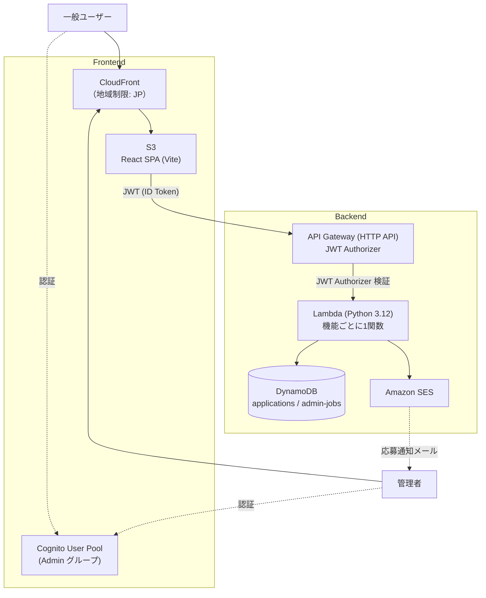
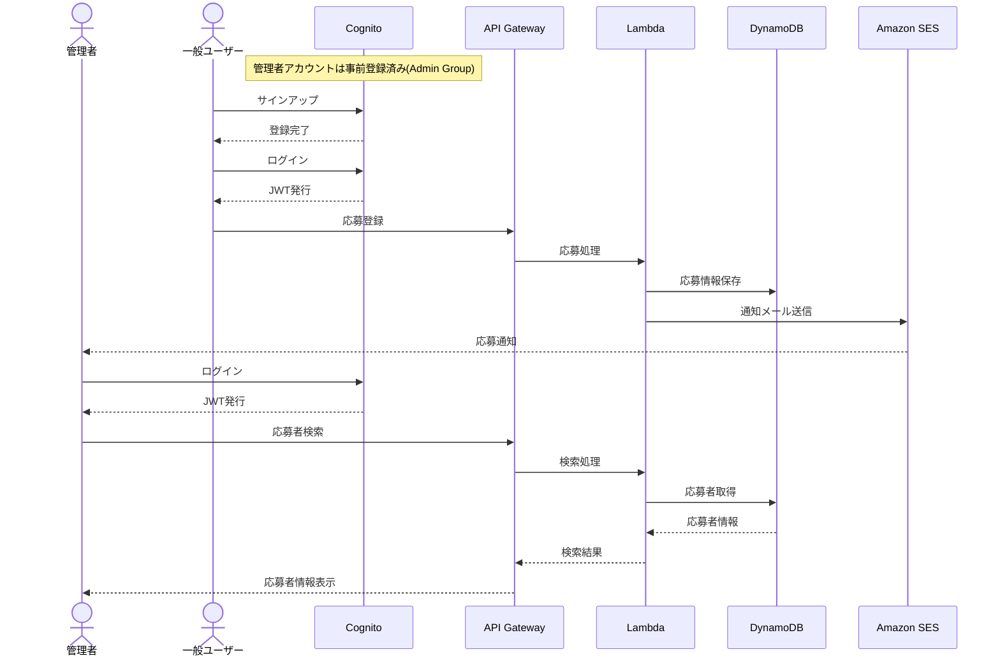

# システムアーキテクチャ

### 1. アーキテクチャ図

#### 1.1 全体像

#### 1.2 サービス連携のシーケンス図

---

## 2. 技術スタック

| Category | Technology |
| :--- | :--- |
| Frontend | React, TypeScript |
| Authentication | Amazon Cognito |
| API | API Gateway |
| Backend | AWS Lambda |
| Database | DynamoDB |
| Mail | Amazon SES |
| Hosting | S3, CloudFront |

---

## 3. 認証方式

* **方式**：Amazon Cognito User Pool + JWT（ID トークン）
* **サインアップ**：メールアドレス／パスワードで登録。`email` 属性を自動検証対象としており、確認コードがメールで送付される（Cognito 標準フロー）
* **ログイン**：`amazon-cognito-identity-js` の SRP 認証フロー（`ALLOW_USER_SRP_AUTH`）を使用
* **トークン有効期限**：ID/Access トークン 60 分、Refresh トークン 7 日
* **権限管理**: `Admin` Cognito グループに所属するユーザーのみ管理者機能を利用可能 **（手動で追加要）**
* **ローカル開発時**：`SKIP_AUTH=true` を設定すると Lambda 側の認可チェックをスキップできる（SAM Local 専用）

---

## 4. インフラ構成

* **本番環境**：Terraform（HCL）で全リソースを一元管理。SAM は使用しない
* **ローカル開発環境**：AWS SAM Local（API Gateway + Lambda エミュレーション）+ Docker（DynamoDB Local, dynamodb-admin）
* **CI/CD**：GitHub Actions
  * `terraform.yml`：本番ブランチへのマージ時に `plan` → `apply` を自動実行（OIDC で AWS 認証）
  * `frontend-deploy.yml`：本番ブランチへのマージ時にフロントエンドをビルドし S3 へ同期、CloudFront キャッシュを無効化
* **環境分離**：現状は単一環境（`environment = "prod"`）。`var.environment` により命名規則上は他環境追加が可能な設計

詳細なフォルダ構成・ローカル開発手順は [README.md](../README.md) を参照。
