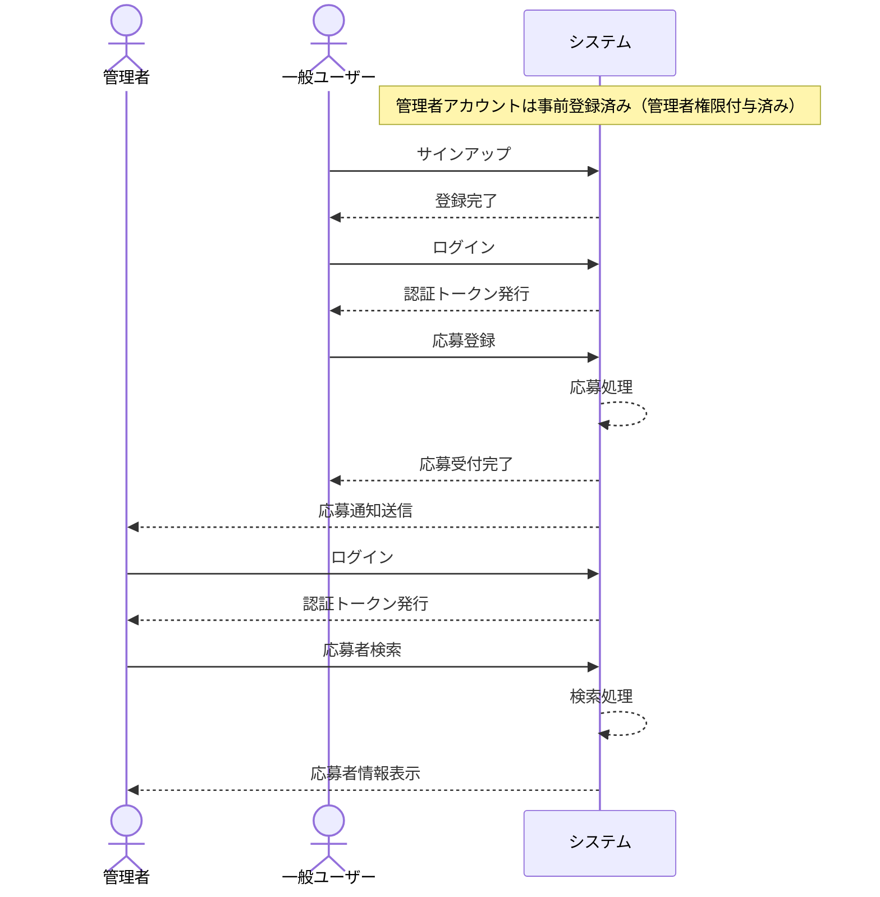

# 業務フロー

---

## 1. 業務概要

本フローは「応募管理システム」における、管理者による案件登録から、ユーザーの会員登録・応募、管理者による応募確認までの一連の業務を対象とする。

---

## 2. 登場人物

- ユーザー（応募者）
- 管理者（採用担当）
- システム（認証・応募管理・通知処理）

---

## 3. 業務フロー全体図

```mermaid
sequenceDiagram

    actor Admin as 管理者
    actor User as 一般ユーザー

    participant System as システム

    Note over System: 管理者アカウントは事前登録済み（管理者権限付与済み）

    User->>System: サインアップ
    System-->>User: 登録完了

    User->>System: ログイン
    System-->>User: 認証トークン発行

    User->>System: 応募登録
    System-->>System: 応募処理
    System-->>User: 応募受付完了

    System-->>Admin: 応募通知送信

    Admin->>System: ログイン
    System-->>Admin: 認証トークン発行

    Admin->>System: 応募者検索
    System-->>System: 検索処理
    System-->>Admin: 応募者情報表示
```
